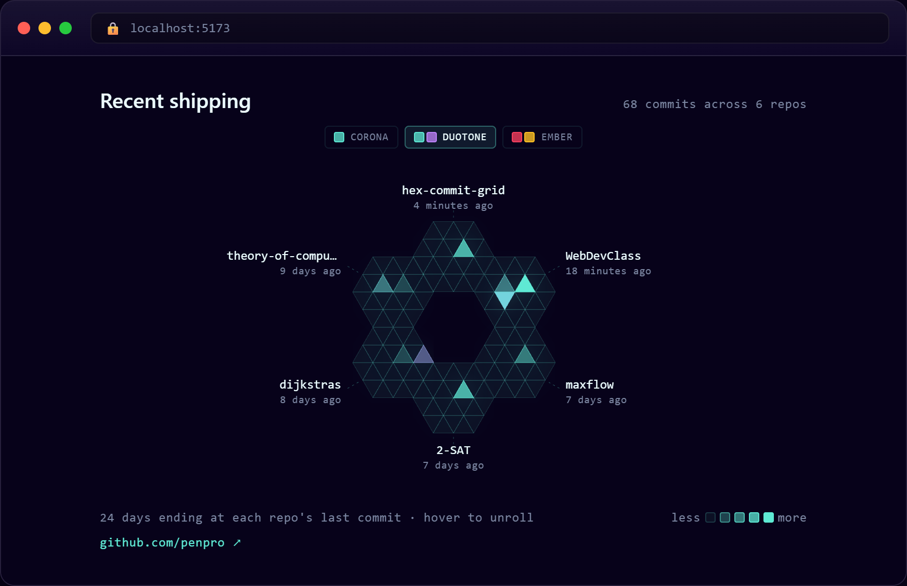
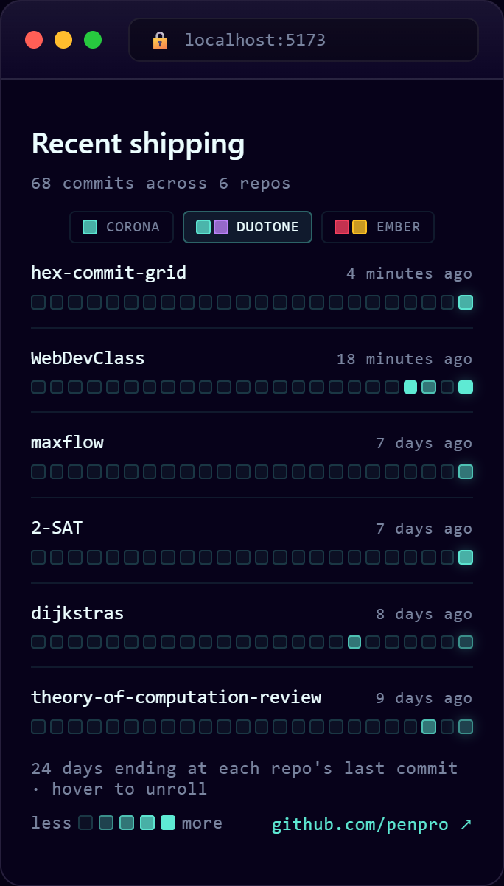

# hex-commit-grid

Animated honeycomb visualization of a GitHub user's commit activity across multiple repos. Pure React + SVG + CSS — no Canvas, no animation libraries, no GitHub API token required.

Each repo is a flat-top hexagon split into 24 triangular cells. The inner 6 triangles show the most recent 6 days of activity; the outer 18 show the prior 18. Hover a hex and the 24 triangles individually translate + rotate into a horizontal alternating-up/down strip — staggered 14ms apart so they appear to unroll.

Six hexes arrange at 60° intervals around an empty center, touching at flat edges (true honeycomb tiling). Repo names + relative-time labels radiate outward.

## Preview



Below 760px the radial layout hands off to a built-in strip-row fallback — one row per repo with a full-width grid of day-cells:



## Install

```bash
npm install hex-commit-grid
```

React 17, 18, or 19 is a peer dependency.

## Usage

```jsx
import { HexCommitGrid } from 'hex-commit-grid';
import 'hex-commit-grid/styles.css';

export default function App() {
  return <HexCommitGrid username="penpro" />;
}
```

That's it. The component fetches the user's most-recently-pushed public, non-fork, non-archived repos from the GitHub API (anonymous; no token needed), buckets commits by day, and renders the hex flower. Result is cached in `sessionStorage` for an hour.

## Props

| Prop | Default | Description |
|------|---------|-------------|
| `username` | _required_ | GitHub username |
| `repoCount` | `6` | How many repos to show (max 6 — the ring has 6 slots) |
| `days` | `24` | Days of activity per repo (matches the 24 triangles) |
| `palettes` | built-in 3 | Palette dictionary. Pass your own to add custom colors |
| `defaultPalette` | `'corona'` | Initial palette key |
| `localStorageKey` | `'hex-commit-grid-palette'` | Where to persist palette choice. Set `null` to disable |
| `cacheTtlMs` | `3600000` (1h) | Repo data cache TTL |
| `title` | `'Recent shipping'` | Header text. Pass `null` to hide the header |
| `showPaletteSelector` | `true` | Render the palette selector buttons |
| `showFooter` | `true` | Render the bottom row (caption + legend + profile link) |
| `className` | `''` | Extra class on the wrapper element |
| `mobileFallback` | _built-in_ | What to render below 760px, where the radial flower has no room. Defaults to a built-in strip-row view (one row per repo: name · relative time · day-cells). Pass `null` to render nothing and supply your own, or pass any React node to render it instead |

## Palettes

Three palettes ship by default:

- **Corona** — single teal, no animation
- **Duotone** — teal ↔ violet pulse
- **Ember** — orange ↔ red pulse

A palette is `{ name, buckets, morph }`:

```js
{
  name: 'Duotone',
  buckets: [
    { bg: 'rgba(94, 234, 212, 0.06)', border: 'rgba(94, 234, 212, 0.18)' },  // bucket 0 — empty
    { bg: 'rgba(94, 234, 212, 0.28)', border: 'rgba(94, 234, 212, 0.45)' },  // bucket 1
    { bg: 'rgba(94, 234, 212, 0.50)', border: 'rgba(94, 234, 212, 0.65)' },  // bucket 2
    { bg: 'rgba(94, 234, 212, 0.75)', border: 'rgba(94, 234, 212, 0.90)' },  // bucket 3
    { bg: 'rgba(94, 234, 212, 1.00)', border: 'rgba(94, 234, 212, 1.00)' }   // bucket 4
  ],
  morph: [
    null,  // bucket 0 doesn't animate — empty cells stay quiet
    { bg: 'rgba(192, 132, 252, 0.28)', border: 'rgba(192, 132, 252, 0.45)' },
    { bg: 'rgba(192, 132, 252, 0.50)', border: 'rgba(192, 132, 252, 0.65)' },
    { bg: 'rgba(192, 132, 252, 0.75)', border: 'rgba(192, 132, 252, 0.90)' },
    { bg: 'rgba(192, 132, 252, 1.00)', border: 'rgba(192, 132, 252, 1.00)' }
  ]
}
```

- `buckets[i]` is the static color for activity level `i` (0 = no commits, 4 = 8+ commits).
- `morph[i]` is the "other" color that bucket-`i` cells cycle to over 8 seconds. `null` disables animation for that bucket.

Add your own:

```jsx
import { HexCommitGrid, PALETTES } from 'hex-commit-grid';

const myPalettes = {
  ...PALETTES,
  ocean: {
    name: 'Ocean',
    buckets: [/* 5 entries */],
    morph: [/* 5 entries or nulls */]
  }
};

<HexCommitGrid username="you" palettes={myPalettes} defaultPalette="ocean" />
```

## Theming (CSS variables)

Override these on a parent element to retheme without forking:

| Variable | Default | What it controls |
|----------|---------|------------------|
| `--hcg-bg` | `rgba(13, 6, 38, 0.94)` | Panel background behind the unrolled strip |
| `--hcg-bg-border` | `rgba(94, 234, 212, 0.35)` | Panel border |
| `--hcg-bg-glow` | `rgba(94, 234, 212, 0.28)` | Panel halo |
| `--hcg-text` | `#ecfeff` | Primary text |
| `--hcg-text-muted` | `#7a85a0` | Secondary text |
| `--hcg-accent` | `#5eead4` | Link / active-state color |
| `--hcg-line-color` | `rgba(94, 234, 212, 0.30)` | Dashed connector lines |
| `--hcg-glow` | `rgba(94, 234, 212, 0.18)` | Hex drop-shadow |
| `--hcg-font-mono` | `'JetBrains Mono', monospace` | Monospace stack |
| `--hcg-font-heading` | `'Space Grotesk', 'Inter', sans-serif` | Heading stack |

Example:

```css
.my-grid {
  --hcg-accent: #ff6600;
  --hcg-text: #fff;
  --hcg-bg: #1a1a1a;
}
```

```jsx
<HexCommitGrid username="you" className="my-grid" />
```

## Limitations

- **Radial layout is desktop-only.** The honeycomb hides below 760px viewport (it doesn't shrink gracefully). Below that, a built-in strip-row fallback renders instead — override or disable it with the `mobileFallback` prop.
- **Anonymous GitHub API rate limit** is 60 requests/hour per IP. Each cold load costs `1 + repoCount` requests. The 1-hour sessionStorage cache covers same-visitor revisits. If you're on a NAT'd corporate IP with heavy traffic, you may need a backend proxy.
- **Only public repos.** The anonymous API can't see private repos.
- **No-fork, no-archived filter.** Repos with `fork: true` or `archived: true` are excluded.

## Develop locally

```bash
git clone https://github.com/penpro/hex-commit-grid.git
cd hex-commit-grid
npm install
npm run dev   # demo at http://localhost:5173
```

## License

MIT © Wesley Weaver Jr.

## Credits

Built as part of [penumbra-tech.com](https://penumbra-tech.com). The "rotated 30°" insight that makes the hexes tile cleanly came from staring at the first preview and realizing pointy-top wedges at 60° intervals leave gaps.
